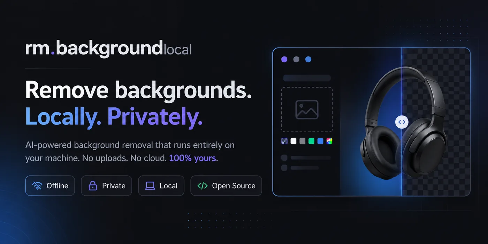

# Remove Background in Local

A fast, private background-removal tool that runs entirely on your own machine.

> Unofficial open-source project. Not affiliated with remove.bg or Canva Austria GmbH.

An offline alternative for people who want a workflow similar to cloud
background-removal services such as remove.bg, without uploading images or
paying API costs. Everything runs locally — no limits, no account, no API.

It ships with **ISNet** as the default (fast and high quality) and also includes **BiRefNet** (2024) — one of the best open-source models for background segmentation — for when you want maximum quality.

## Features

- Web UI with drag & drop (paste from clipboard works too)
- **Processing queue** — drop several images at once and they are processed one
  by one; each result is kept in its own card, nothing gets overwritten
- **Persistent sessions** — results are saved locally (in the browser) and
  grouped into sessions in the sidebar; they survive reloads until you delete
  them. "New session" starts a fresh batch without losing the old ones
- **Download as PNG, WEBP or JPG**, with the background you choose (transparent
  or a solid color) — per image or all at once
- **Per-result background** to check contrast, independent of the global default
- **First-run setup screen** with a real download progress bar
- **Models page** in the top menu: what each model is best for, which ones are
  downloaded, and a button to pre-download any of them (with progress)
- Switch between 6 models depending on the case (general, portrait, lite, etc.)
- Alpha matting mode for fine edges (hair, plants)
- 100% local processing — your images never leave your machine
- No limits on count or resolution (beyond the file-size cap)

## Requirements

- Mac with Apple Silicon (also works on Intel and other systems, just slower)
- Python 3.9 or newer
- ~2 GB of free disk space (models + dependencies)

Check that you have Python:

```bash
python3 --version
```

If you don't, install it from [python.org](https://www.python.org/downloads/) or with Homebrew: `brew install python`

## Install and run

### Option A — one command (npx)

If you have Node.js and Python 3.9+ installed:

```bash
npx -y remove-background-local
```

This bootstraps a Python environment, installs the dependencies and starts the
server — then opens **http://127.0.0.1:7860** in your browser. (Node can't install
Python itself, so Python 3.9+ must already be available.)

### Option B — from source

```bash
git clone https://github.com/tecnomanu/remove-background-local
cd remove-background-local
./run.sh
```

The first run will:

1. Create a `.venv` virtual environment
2. Install the Python dependencies (can take 2–5 minutes)
3. Start the server

After that, every `./run.sh` starts in a few seconds.

Open in your browser: **http://127.0.0.1:7860**

> The first time you use a model it is downloaded automatically (between 100 and 400 MB depending on the model). After that it stays cached in `~/.u2net/`.

> **Moved the folder?** A Python virtualenv stores absolute paths, so a copied/moved `.venv` is broken. `run.sh` detects this automatically and rebuilds the environment — you don't have to do anything.

## Usage

1. Drag one or more images onto the box (or click to choose, or paste with Cmd+V)
2. They are added to the queue and processed one by one
3. Download each result, or use **Download all**

### Which model to choose

Times below are rough per-image figures on Apple Silicon (CPU execution).

| Model | When to use it | Speed |
|---|---|---|
| `isnet-general-use` | **Default.** Fast and very good quality for any image. | ~1s |
| `u2net` | The classic — good for simple products. | ~0.5s |
| `u2net_human_seg` | People only. | ~0.5s |
| `birefnet-general-lite` | Higher quality, still reasonable. | ~9s |
| `birefnet-general` | Best quality for any image. | ~20s |
| `birefnet-portrait` | People, best quality (difficult hair). | ~20s |

> **Why ISNet by default and not BiRefNet?** BiRefNet is the highest-quality
> model, but it is large (~930 MB) and slow on CPU. ISNet is the better default
> for a tool that should "just work" — fast, reliable, and still excellent
> quality. Switch to a BiRefNet model from the selector whenever you want
> maximum quality and don't mind the wait.

### Alpha matting (optional)

In the "Advanced options" section you can enable **alpha matting**. It's slower but gives better edges in difficult cases (loose hair, transparency, mesh).

- **FG threshold**: pixels clearly belonging to the object (default 240, raise it if it eats parts of the object)
- **BG threshold**: pixels clearly belonging to the background (default 10, lower it if it leaves background leftovers)
- **Erode**: fine edge adjustment

## Advanced configuration

Environment variables before running `./run.sh`:

```bash
HOST=0.0.0.0 PORT=8000 ./run.sh         # Change port / expose to the local network
REMBG_MODEL=birefnet-general ./run.sh   # Change the default model
MAX_UPLOAD_MB=100 ./run.sh              # Raise the size limit

# Execution provider (advanced). CPU is the default because the onnxruntime
# CoreML provider hangs on some models on Apple Silicon. CPU is fast enough for
# the lighter models. Only change this if you know what you are doing:
REMBG_PROVIDERS=CoreMLExecutionProvider,CPUExecutionProvider ./run.sh
```

## Programmatic use (no UI)

The POST `/remove` endpoint accepts `multipart/form-data`:

```bash
curl -X POST http://127.0.0.1:7860/remove \
  -F "image=@photo.jpg" \
  -F "model=birefnet-general" \
  -o photo_nobg.png
```

Process a whole folder in batch:

```bash
for f in *.jpg; do
  curl -s -X POST http://127.0.0.1:7860/remove \
    -F "image=@$f" \
    -F "model=birefnet-general" \
    -o "${f%.*}_nobg.png"
  echo "ok: $f"
done
```

### Endpoints

| Method | Path | Description |
|---|---|---|
| `GET` | `/` | Web UI |
| `POST` | `/remove` | Remove background, returns a transparent PNG |
| `GET` | `/models` | List of available models (with approx sizes) |
| `GET` | `/model_status` | Load state of a model (idle / loading / ready / error) |
| `POST` | `/warmup` | Start loading a model in the background (non-blocking) |
| `GET` | `/health` | Server status |

## Expected performance on Mac Apple Silicon (CPU)

With the default ISNet model: roughly **~1 second per image**. U2Net is even faster
(~0.5s). The BiRefNet models are slower (~9–20s) but give the highest quality.

The first request to a given model is slower because it downloads (one time) and
loads the model into memory. The first-run setup screen shows this is happening.

## Troubleshooting

**`onnxruntime` install error**: on some older Macs it can fail. Try:

```bash
.venv/bin/pip install onnxruntime --upgrade
```

**The model won't download**: check your internet connection — the first time it needs to fetch the model from Hugging Face / GitHub. After that it works 100% offline.

**Bad quality on some image**: try another model from the selector. For maximum quality, use a BiRefNet model; for people with difficult hair, BiRefNet portrait + alpha matting is usually best.

**Port 7860 in use**: change it with `PORT=8000 ./run.sh`

**I moved the project folder and it stopped working**: a Python virtualenv stores
absolute paths, so a copied/moved `.venv` is broken. `run.sh` detects this and
rebuilds the environment automatically — just run `./run.sh` again.

## Development

Run the test suite (fast, no network needed — model loading is mocked):

```bash
./run_tests.sh
```

Contributing or using an AI agent on this repo? Read [AGENTS.md](AGENTS.md) — it
covers the architecture, conventions (English, no emojis, CPU default), and the
rule that every commit must keep the tests green. CI runs the tests on every push.

## Project structure

```
remove-background-local/
├── server.py            # FastAPI backend
├── static/
│   └── index.html       # Frontend (single file)
├── requirements.txt     # Python dependencies
├── requirements-dev.txt # Test dependencies
├── run.sh               # Startup script
├── run_tests.sh         # Test runner
├── tests/               # pytest suite
├── AGENTS.md            # Guide for contributors / AI agents
└── README.md            # This file
```

## Model licenses

- **BiRefNet**: MIT (commercial use OK)
- **ISNet**: Apache 2.0 (commercial use OK)
- **U2Net**: Apache 2.0 (commercial use OK)

All open source and usable commercially at no cost.

## License

MIT
